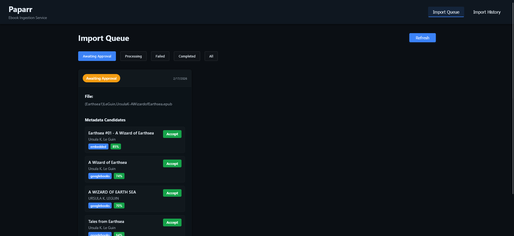
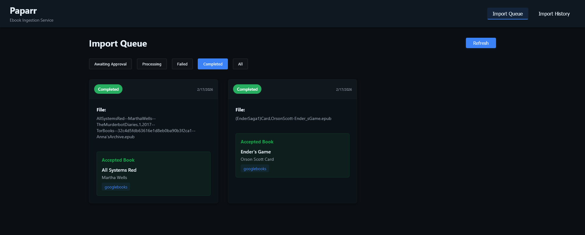
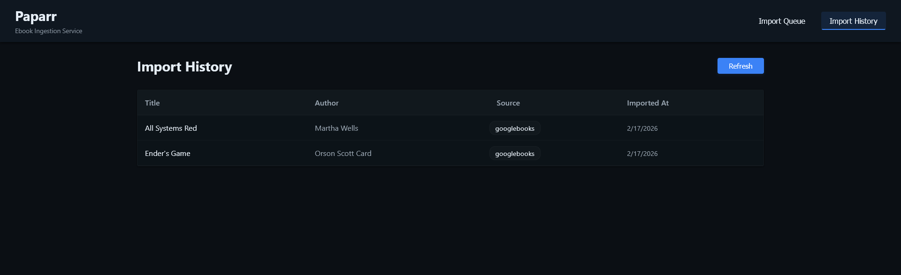
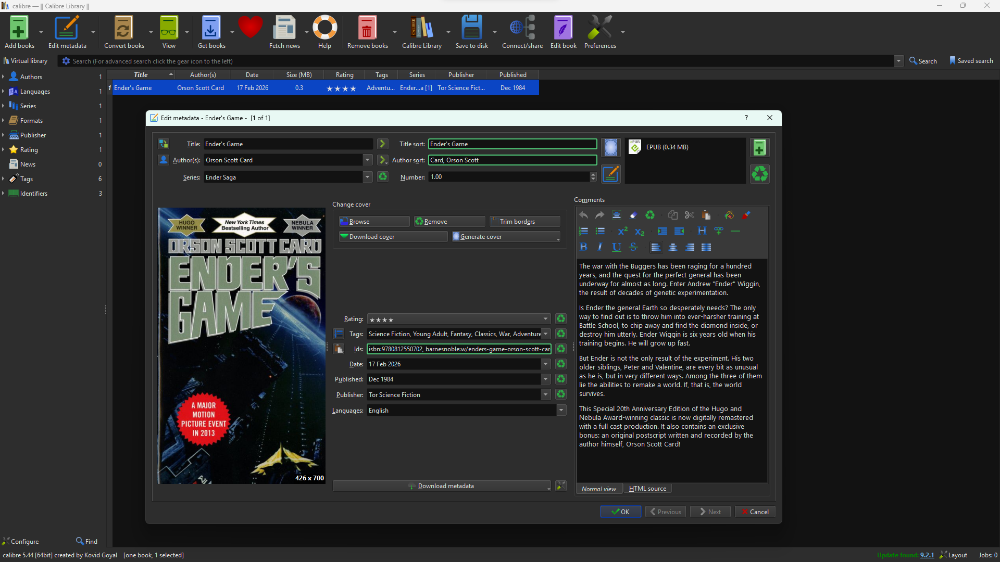

# Paparr - Self-Hosted Ebook Ingestion Service

Paparr is a dockerized ebook ingestion service inspired by Radarr. It automates the process of importing ebooks from various sources, extracting/enriching metadata, and organizing the files into a standard library. It is meant to be hosted on a homelab for personal use. Paparr is most useful running in conjunction with Calibre or [Calibre Web Automated](https://github.com/crocodilestick/Calibre-Web-Automated).

## Features

- **Automated File Ingestion**: Polls a watch directory and processes new EPUB and PDF files
- **Smart Metadata Extraction**: Extracts from embedded metadata, filename parsing, Open Library and Google Books APIs
- **Manual Review Interface**: Clean React UI for approving/selecting metadata candidates when the confidence threshold for automatically applying metadata was not reached
- **Calibre-Compatible Structure**: Organizes books in folder structure compatible with existing Calibre libraries
- **Docker Support**: Complete docker-compose setup for one-command deployment

## Tech Stack
- **Backend**: ASP.NET Core 10 Web API
- **Database**: PostgreSQL 18.1
- **Frontend**: React 18

## Quick Start with Docker

`
cd Paparr
`  
`
docker-compose up --build
`

### Access:
- **UI**: http://localhost:5173
- **API**: http://localhost:5000/api
- **Swagger**: http://localhost:5000/swagger

## Environment Variables

`
{
  "IngestPath": "/ingest",
  "LibraryPath": "/library"
}
`

## Metadata Extraction Priority

1. **Embedded Metadata** (EPUB/PDF metadata)
2. **Filename Parsing** (format: "Title - Author.ext")
3. **Open Library API** (https://openlibrary.org)
4. **Google Books API** (https://www.googleapis.com/books/v1/volumes)

## File Organization

### Books are organized in Calibre-compatible structure:  
`/library/Author Name/Book Title/Book Title - Author Name.epub` 

## Screenshots

